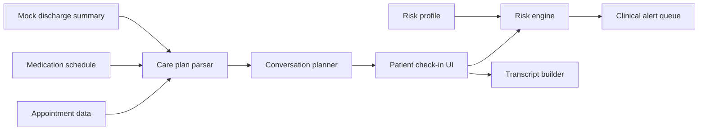

# Design: WellCheck Agent

## Overview

WellCheck is a browser-based hackathon demo that simulates an AI-powered post-discharge check-in workflow. It turns mock discharge information into a structured recovery plan, runs a patient conversation, detects risk signals, and creates a clinical alert output for the discharge coordinator.

The standout product shape is a coordinator cockpit rather than a single chatbot. The first screen shows the operational queue: who is urgent, why they are urgent, what language support they need, and what the coordinator should do next.

## Architecture



## Components

### Static Data

`data/sample-patient.js` exports a synthetic patient profile, discharge plan, medication schedule, appointment, warning signs, and canned scenarios.

### Care Plan View

Displays the extracted recovery plan in coordinator and patient-friendly language. This proves the assistant understands the discharge summary and can convert it into plain English.

### Conversation Simulator

Runs a deterministic chat transcript for selected scenarios:

- Routine recovery
- Missed medication
- Worsening symptoms
- Non-English support

The deterministic approach is deliberate for hackathon reliability. Kiro or a later backend can replace the canned patient simulation with an LLM while preserving the same requirements.

### Risk Engine

Scores patient responses based on:

- Baseline risk profile: age, condition, readmission risk
- Missed critical medication
- Worsening symptoms
- Severe safety signals
- Missed appointment or transportation barrier

Severity levels:

- Routine: no concerning answer
- Watch: mild concern or education need
- Alert: missed medication or worsening symptom
- Urgent: severe symptom or multiple high-risk signals

### Optional Kimi API Proxy

The demo can call Kimi through the local PowerShell server at `POST /api/agent`. The browser sends only synthetic patient, scenario, and alert data to the local server. The server reads `KIMI_API_KEY` from its environment and calls Kimi's OpenAI-compatible chat completions endpoint.

This keeps the API key out of frontend code and preserves the deterministic risk engine as the safety source of truth. Kimi is used only to draft a coordinator-facing note.

### Clinical Alert Output

The alert card includes:

- Patient name and risk category
- Severity
- Evidence from transcript
- Recommended coordinator action
- Timestamp and transcript reference

### Coordinator Queue and Metrics

The queue contains multiple synthetic discharged patients with condition, language, last check-in, owner, and risk level. Each row is scored using the deterministic risk engine and visually labeled as routine, watch, alert, or urgent.

Dashboard metrics summarize the workload:

- Patients monitored
- Clinical alerts
- Urgent cases today
- Estimated coordinator time saved

### Explainability Panel

Every alert includes a traceable reason list:

- baseline risk contribution
- medication adherence signal
- matched warning sign
- follow-up barrier
- no-trigger confirmation for routine scenarios

This panel is designed for judge trust and future clinical governance.

## Data Model

```ts
type PatientProfile = {
  id: string;
  name: string;
  age: number;
  language: string;
  condition: string;
  baselineRisk: "standard" | "high";
};

type Medication = {
  name: string;
  dose: string;
  timing: string;
  critical: boolean;
};

type Scenario = {
  id: string;
  label: string;
  responses: PatientResponse[];
};

type Alert = {
  severity: "routine" | "watch" | "alert" | "urgent";
  evidence: string[];
  recommendedAction: string;
};
```

## Safety and Compliance Notes

- The demo uses synthetic data only.
- It does not diagnose, prescribe, or replace a clinician.
- It escalates concerning answers to a human care team.
- It is designed as a care coordination assistant, not a clinical decision system.

## Testing Strategy

- Unit-test the risk engine with routine, missed medication, worsening symptom, and urgent scenarios.
- Smoke-test that `index.html` loads without network access.
- Verify `/api/agent` returns a clear configuration error when `KIMI_API_KEY` is not set.
- Verify the demo can be completed in under three minutes.

## Presentation Flow

1. Show the persona: a discharge coordinator managing many patients.
2. Show the problem: patients misunderstand instructions after discharge.
3. Open WellCheck and select "Worsening symptoms."
4. Let the check-in transcript populate.
5. Show the alert queue with evidence and recommended action.
6. Close with impact: faster triage, clearer patient guidance, fewer preventable readmissions.
