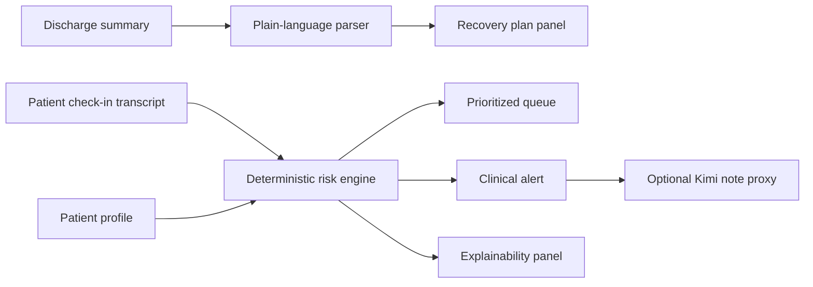

# Design: WellCheck Command Center

## Architecture

## Components

- `index.html`: command center layout
- `data/app-data.js`: synthetic patient and discharge data
- `src/app.js`: parsing, scoring, rendering, Kimi call
- `src/styles.css`: responsive cockpit UI
- `scripts/dev-server.ps1`: optional static server and Kimi proxy

## Risk Engine

Severity is deterministic:

- high baseline risk: +2
- missed or misunderstood medication: +2
- breathing concern: +3
- swelling/fluid signal: +2

Severity thresholds:

- urgent: 7+
- alert: 4-6
- watch: 2-3
- routine: 0-1

## Safety

WellCheck escalates evidence to the care team. It does not diagnose, prescribe, or replace clinicians.
